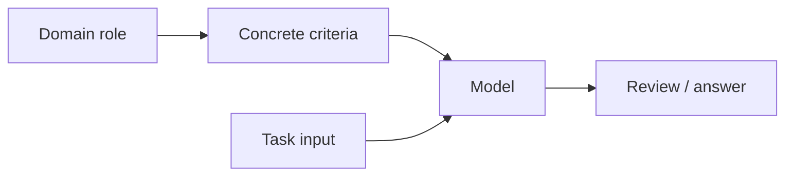

# Role & Persona Prompting

Role prompting gives the model a domain frame or responsibility such as reviewer, tutor, support classifier, or analyst.

A useful role narrows the task. It does not magically grant expertise or authority.

## Useful role framing

```text
You are reviewing a pull request for authorization and tenant-isolation regressions.
Check for missing ownership filters, confused-deputy behavior, SSRF, and secret exposure.
```

This is measurable because it names the review criteria.

## Weak role framing

```text
You are the world's greatest cybersecurity genius.
```

That adds theater but does not define what to inspect.

## Mental model



## TypeScript prompt component

```ts
function reviewerPrompt(diff: string): string {
  return `
ROLE
You are a security reviewer for a multi-tenant SaaS application.

CHECK
- authorization bypasses
- missing tenant filters
- SSRF
- secret exposure

<DIFF>
${diff}
</DIFF>
`.trim();
}
```

## Role vs permission

A role in the prompt is semantic context. It is **not** an application permission role.

```mermaid
flowchart TD
  PR[Prompt role: "support agent"] --> MODEL[Model behavior]
  IAM[Authenticated IAM role] --> AUTH[Authorization policy]
  MODEL --> ACTION[Proposed action]
  ACTION --> AUTH
```

Never infer privileges because the prompt says “you are an administrator.”

## Practice

1. Rewrite a fictional persona into a measurable domain role.
2. Explain prompt role vs authenticated user role.
3. Create a role prompt for a senior TypeScript code reviewer.
