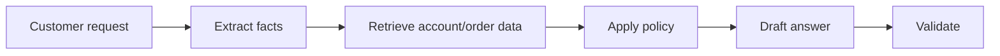
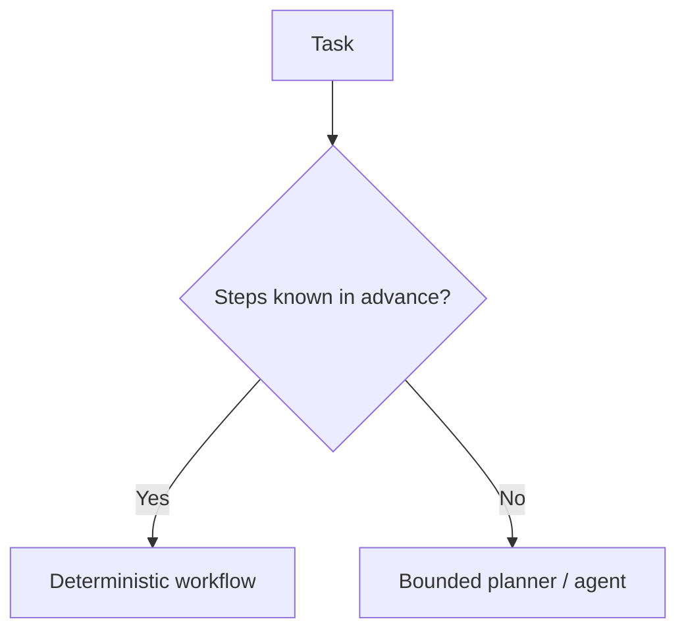

# Task Decomposition

Task decomposition breaks a difficult problem into smaller stages that can be checked independently.

Use decomposition when the task has distinct subproblems—not simply because “more steps” sounds more intelligent.

## Example flow



When the sequence is known, encode it as an application workflow rather than asking the model to invent the process every time.

## Typed stages

```ts
type Facts = {
  orderId: string | null;
  requestedAction: "refund" | "status" | "other";
};

type Decision = {
  allowed: boolean;
  reason: string;
};

async function workflow(message: string) {
  const facts: Facts = await extractFacts(message);
  const evidence = facts.orderId ? await lookupOrder(facts.orderId) : null;
  const decision: Decision = applyPolicy(facts, evidence);
  return draftResponse(facts, evidence, decision);
}
```

The model may handle extraction or drafting while deterministic code handles policy.

## Decomposition vs agent planning



Do not pay agent-planning cost for a fixed three-step business process.

## Practice

1. Decompose a RAG question-answering pipeline.
2. Which steps should be deterministic in a refund workflow?
3. When would an agent planner be justified instead of fixed orchestration?
