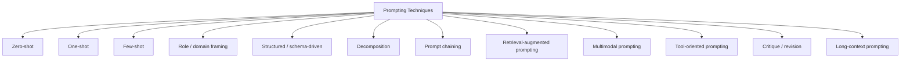
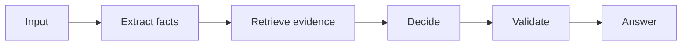
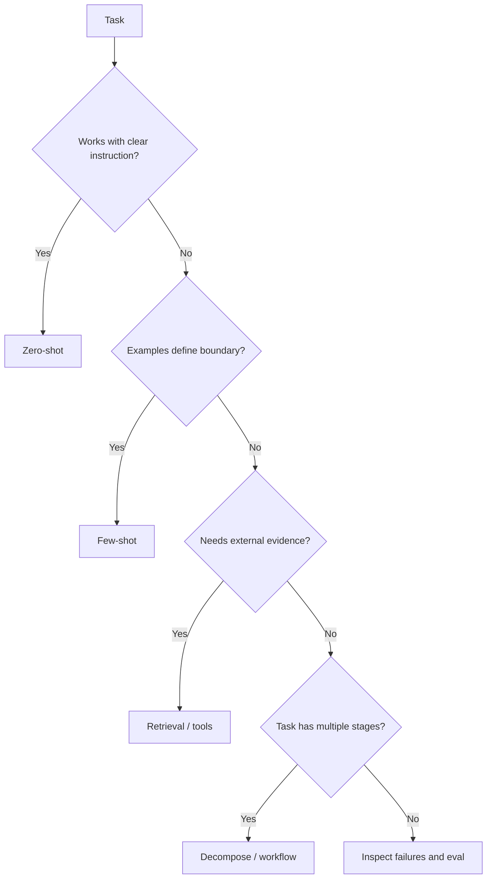

# Types of Prompting

“Prompt type” is not one official taxonomy. In practice, engineers use several recurring prompting patterns depending on the task.

## Technique map



## Zero-shot prompting

Give instructions without examples.

```text
Classify this ticket as billing, account, bug, or other.
Ticket: "I was charged twice."
```

Start here when the task is clear and the model already performs well.

## One-shot prompting

Give one example.

```text
Example:
Input: "Cannot reset my password"
Output: account

Now classify:
Input: "I was charged twice"
```

One example can demonstrate format or a critical boundary.

## Few-shot prompting

Give several carefully selected examples.

```text
Input: "Charged twice" → billing
Input: "Password reset fails" → account
Input: "App crashes after login" → bug
```

Use examples that teach difficult distinctions, not dozens of repetitive obvious cases.

## Role or domain framing

```text
Review this pull request for authorization bypasses, SSRF, secret exposure,
and missing tenant filters.
```

A concrete domain role can focus attention. Avoid fictional persona theater that adds tokens without measurable value.

## Structured prompting

Separate sections and define a machine contract.

```text
TASK
...
CONTEXT
...
CONSTRAINTS
...
OUTPUT
...
```

For machine outputs, pair this with JSON Schema/Zod or provider structured-output support.

## Decomposition

Break a complex task into smaller checkable stages.



If the steps are fixed, ordinary code/workflow orchestration is often better than asking the model to invent the plan.

## Prompt chaining

The output of one step becomes controlled input to the next.

```ts
type ExtractedFacts = { customerId: string; issue: string };

declare function extract(text: string): Promise<ExtractedFacts>;
declare function retrieve(facts: ExtractedFacts): Promise<string[]>;
declare function answer(facts: ExtractedFacts, sources: string[]): Promise<string>;
```

Each boundary can be evaluated independently.

## Retrieval-augmented prompting

Retrieve evidence first, then ask the model to answer from it.


## Multimodal prompting

Combine text with images, audio, video, or documents when the model supports them.

```text
Text instruction + screenshot → identify UI error and explain fix
```

## Tool-oriented prompting

Describe available capabilities and when they are appropriate, but keep authorization outside the model.

```text
Use order_lookup for current order status.
Do not infer status from conversation history.
```

## Critique and revision


Only add extra calls when evals show a real quality benefit.

## Long-context prompting

Provide a large bounded context directly instead of retrieving small chunks. Useful when the source fits and holistic comparison matters, but still evaluate position effects, conflicting evidence, cost, and injection risk.

## Choosing a technique



## Production rule

Do not select prompting techniques by folklore. Build a representative eval set and compare candidate designs on quality, safety, latency, and cost.

## Practice

1. When is zero-shot preferable to few-shot?
2. Why can too many examples make a prompt worse?
3. Which technique would you use for answering from private product manuals?
4. Which part of a tool-using prompt should remain deterministic in code?
