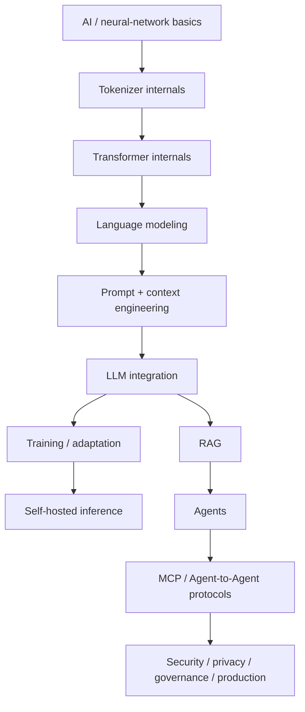

# Zero-to-Hero Gap Closure

This audit records the August 2026 expansion created after comparing the handbook with current official LLM, training, inference, agent, MCP and multimodal documentation.

## New focused lessons

The expansion adds **107 focused lessons** under `docs/ai-engineering/zero-to-hero/`. Every lesson includes a Mermaid diagram, TypeScript/application code example and practice section.

| Track | Focus |
|---|---|
| Neural Network Training | forward/loss, gradients/backprop, optimizers, batches, splits, regularization, full loop, precision/hardware |
| Tokenizers & Chat Model Internals | vocabulary/special tokens, BPE/WordPiece/Unigram, padding/masks, chat templates, tokenizer training, token efficiency |
| Transformer Internals | transformer block, residual/norm, MLP/SwiGLU, RoPE, MHA/MQA/GQA, causal masking, MoE, encoder/decoder families |
| Language Modeling & Decoding | causal objective, cross-entropy/perplexity, base/instruct/chat, decoding, logprobs/stops, speculative decoding |
| Context Engineering | budgets, history, compaction, memory vs state, long context, poisoning/evals |
| LLM API Integration | first request, response items, state, streaming, background/webhooks/batch, realtime, multimodal input, reliability, routing |
| Training & Post-Training | data curation, pretraining, SFT, DPO/preferences, RLHF/RLAIF, reinforcement fine-tuning, LoRA/QLoRA, lineage/contamination |
| Self-Hosted LLMs & Inference | Transformers, llama.cpp/GGUF, vLLM, prefill/decode, PagedAttention/continuous batching, quantization, distributed inference, capacity |
| Advanced RAG | late interaction, multi-vector, fusion, GraphRAG, SQL/Code RAG, multimodal RAG, adaptive/corrective/self-reflective RAG, index migration |
| OpenAI Agents SDK TypeScript | agent loop, function tools, guardrails, handoffs/manager patterns, sessions/HITL, sandbox, tracing/evals, realtime/MCP |
| MCP | full 2026-07-28 architecture and migration path |
| Agent-to-Agent Interoperability | Agent Cards, skills, tasks/messages/artifacts, streaming/push, MCP comparison, security/multi-tenancy |
| Multimodal Understanding | vision, PDFs/layout/OCR, charts/diagrams, audio, video, security/evals |
| Privacy & Governance | data-flow maps, ZDR/retention, files/caches/state, tenant/region isolation, redaction, supply-chain governance |

## Progression



```ts
export type ZeroToHeroStage =
  | 'foundations'
  | 'model-internals'
  | 'integration'
  | 'training'
  | 'retrieval'
  | 'inference'
  | 'agents-and-protocols'
  | 'production-governance';
```

## Practice

Use this audit as a checklist: pick one row, explain the architecture without notes, implement a minimal example, identify its failure/security modes, then compare your implementation with the current official source.
