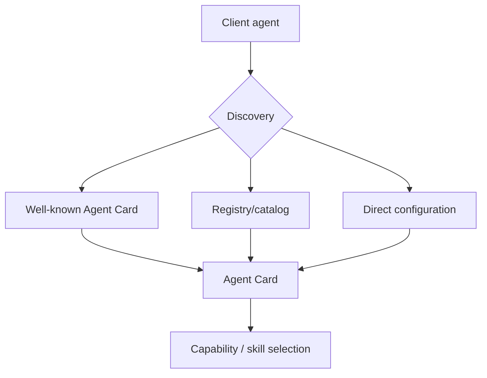

# Agent Cards, Skills & Discovery

An **Agent Card** is the discovery document for an A2A Server. It advertises identity, service endpoint, capabilities, supported interfaces/authentication and skills.



```ts
type AgentCardView = {
  name: string;
  description?: string;
  url: string;
  skills: Array<{ id: string; name: string }>;
  capabilities?: { streaming?: boolean; pushNotifications?: boolean };
};
```

Discovery metadata is not authorization. Verify domain/identity, signature where used, trust policy and security requirements before sending confidential data or delegating actions.

## Practice

1. What does the Agent Card tell a client?
2. Name three discovery mechanisms.
3. Why must clients validate security requirements before invocation?
4. How would you cache Agent Cards safely?
