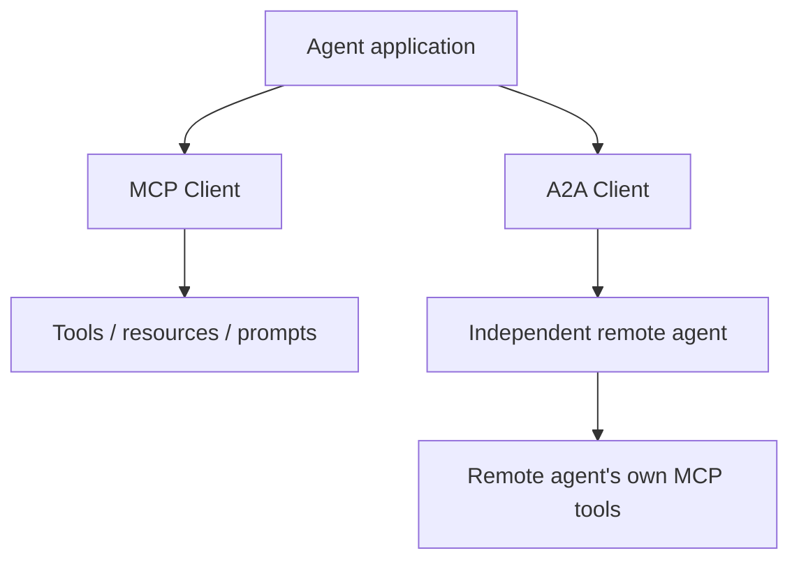

# MCP vs A2A: Tools vs Remote Agents

MCP and A2A solve different interoperability boundaries and can be used together.



| Question | MCP | A2A |
|---|---|---|
| Primary relationship | application/agent ↔ capability server | agent ↔ remote agent |
| Unit of work | tool/resource/prompt operations | messages/tasks/artifacts |
| Internal autonomy | server exposes capabilities | remote agent may plan/operate independently |
| Discovery | MCP server/protocol discovery | Agent Card + skills/capabilities |

```ts
type DelegationTarget =
  | { kind: 'tool'; protocol: 'mcp'; name: string }
  | { kind: 'agent'; protocol: 'a2a'; agentUrl: string };
```

## Practice

1. Why is A2A not a replacement for MCP?
2. Why is MCP not a remote-agent delegation protocol?
3. Draw a system where an A2A remote agent uses MCP internally.
4. Which boundary should carry user authorization context in that system?
