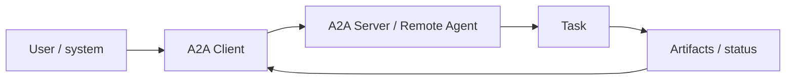

# Agent2Agent (A2A) Protocol Fundamentals

A2A standardizes communication between independent agentic systems. It is not a tool protocol and does not define how one agent internally runs sub-agents.



Core concepts include A2A Client, A2A Server, Agent Card, Message, Part, Task, Artifact, streaming, push notifications, context and extensions.

```ts
type RemoteAgent = {
  name: string;
  endpoint: string;
  skills: string[];
  streaming: boolean;
};
```

## Boundary

Use A2A when one autonomous/opaque agent delegates work to another independent agent. Use MCP when an LLM application needs tools/resources/prompts from a capability server.

## Practice

1. What is an A2A Server?
2. How is an agent different from a tool?
3. Why does A2A preserve agent implementation opacity?
4. When would a normal internal function call be simpler than A2A?
