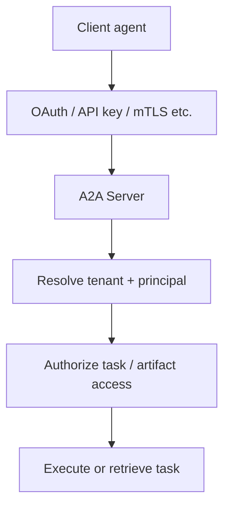

# A2A Authentication, Authorization & Multi-Tenancy

A2A uses standard web security patterns. The Agent Card declares security schemes; actual credentials are transmitted through the binding/HTTP security layer rather than embedded casually in model-visible messages.



```ts
type A2aPrincipal = {
  subject: string;
  tenantId: string;
  scopes: string[];
};
```

Task IDs and context IDs are identifiers, not authorization proofs. The server must verify that the authenticated principal may access the requested task, artifact or push-notification configuration.

## Practice

1. Why shouldn't OAuth tokens be placed in ordinary agent Messages?
2. What must happen before returning a Task by ID?
3. How can multi-tenant task listing leak data?
4. What should be audited when one agent delegates a sensitive task to another?
