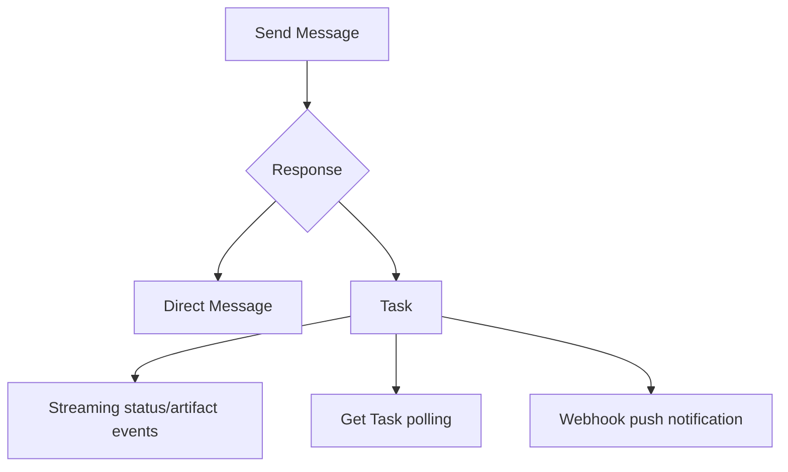

# Streaming, Push Notifications & Long-Running Tasks

A2A supports synchronous message exchange, streaming task updates and push notifications for long-running/disconnected clients.



```ts
type TaskUpdate =
  | { type: 'status'; taskId: string; state: string }
  | { type: 'artifact'; taskId: string; artifactId: string; append?: boolean };
```

For push notifications, authenticate the sender, validate webhook URLs, prevent SSRF, deduplicate events and fetch authoritative task state rather than trusting a single webhook payload as the sole source of truth.

## Practice

1. When is streaming preferable to polling?
2. When are push notifications preferable to an open stream?
3. Why must webhook endpoints defend against SSRF?
4. What should a client do after receiving a push notification?
