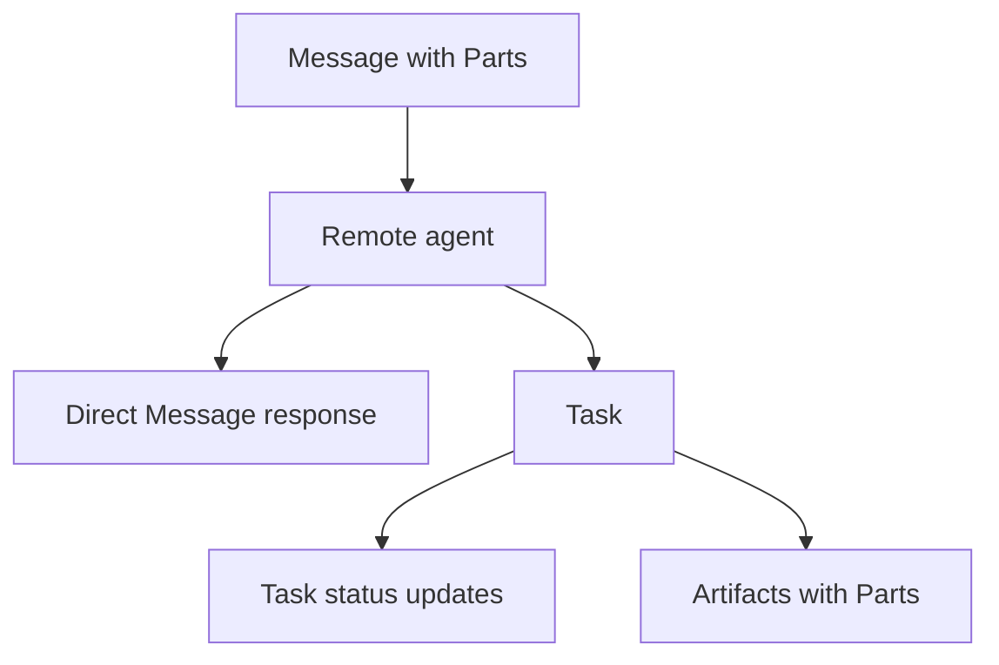

# Messages, Tasks, Parts & Artifacts

A2A separates communication from durable work output.



A `Message` is a communication turn. A `Task` is the stateful unit of work. An `Artifact` is a deliverable produced by a task. `Parts` carry text, files or structured data.

```ts
type TaskState = 'submitted' | 'working' | 'input-required' | 'completed' | 'failed' | 'canceled' | 'rejected';

type Artifact = {
  artifactId: string;
  name?: string;
  parts: unknown[];
};
```

Do not use transient status messages as the only reliable store of critical results. Persist/retrieve task state and artifacts through the protocol's task lifecycle.

## Practice

1. When may a remote agent return a Message instead of a Task?
2. Why are Artifacts different from Messages?
3. What belongs in `contextId` versus `taskId`?
4. How would a client recover results after disconnecting from a stream?
