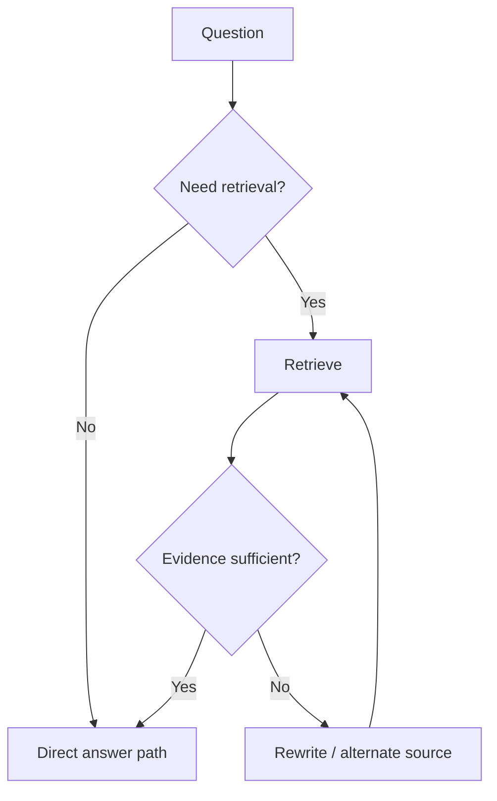

# Adaptive, Corrective & Self-Reflective RAG

Advanced RAG systems can decide whether retrieval is needed, judge retrieval quality, rewrite the query or retry through another route.



```ts
type RetrievalDecision = {
  required: boolean;
  route?: 'docs' | 'web' | 'sql' | 'graph';
  maxAttempts: number;
};
```

## Bound the loop

Self-reflection is not free reliability. Add max attempts, source diversity, latency/cost budgets and an explicit insufficient-evidence outcome.

## Practice

1. When should retrieval be skipped?
2. What makes corrective RAG different from ordinary top-k retrieval?
3. Why must retry loops be bounded?
4. How would you evaluate routing accuracy separately from answer quality?
