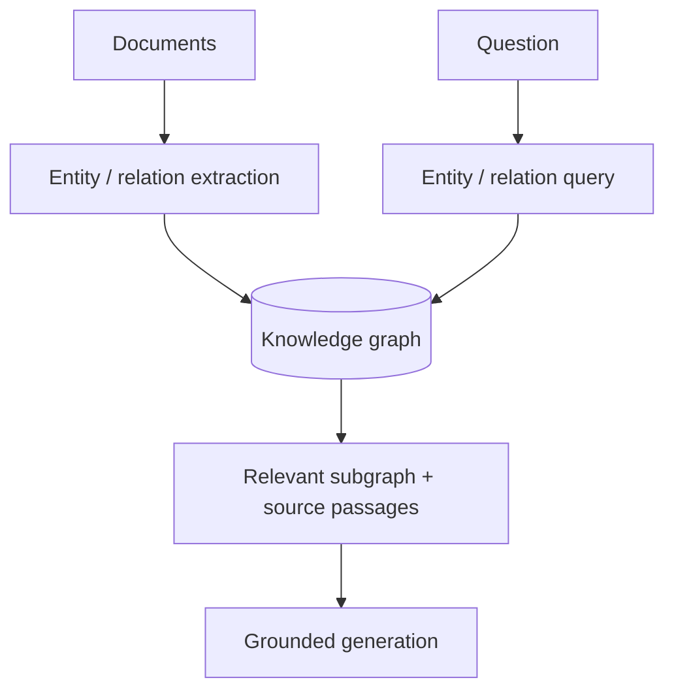

# GraphRAG & Knowledge-Graph Retrieval

GraphRAG augments text retrieval with entities, relationships, graph neighborhoods or graph-derived summaries. It is useful when the question depends on connections across documents rather than one locally similar passage.



```ts
type Edge = { from: string; relation: string; to: string; sourceId: string };
```

## Important distinction

Graph extraction can hallucinate relations. Preserve source provenance and allow final answers to cite original evidence, not only graph assertions.

## Practice

1. Which questions benefit from graph traversal?
2. Why must graph edges retain provenance?
3. How can entity-resolution errors damage GraphRAG?
4. Compare GraphRAG with multi-hop dense retrieval.
