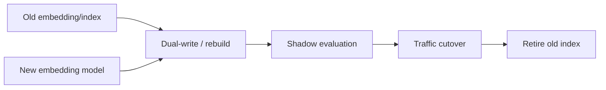

# Embedding & Index Migration

Embedding vectors are tied to a model/version and dimension. Changing embedding models normally requires re-embedding corpus content and building a compatible index.



```ts
type EmbeddingVersion = {
  model: string;
  dimension: number;
  normalization: 'none' | 'l2';
  indexVersion: string;
};
```

## Safe migration

Rebuild asynchronously, evaluate retrieval on a held-out set, run shadow queries or canary traffic, then cut over with rollback. Do not mix vectors from incompatible embedding spaces in one similarity index.

## Practice

1. Why can't you usually compare old-model and new-model vectors directly?
2. What does dual-index migration buy you?
3. Which retrieval metrics should gate cutover?
4. What metadata must each stored vector carry?
