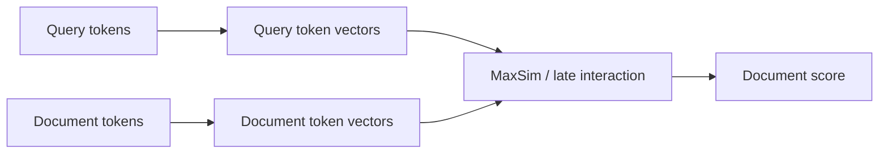

# Late Interaction & ColBERT-Style Retrieval

Single-vector retrieval compresses a document/chunk into one embedding. **Late interaction** keeps multiple token-level vectors and scores query/document interactions later, preserving finer-grained matching.



```ts
function maxSim(query: number[][], doc: number[][], dot: (a:number[], b:number[]) => number) {
  return query.reduce((sum, q) => sum + Math.max(...doc.map(d => dot(q, d))), 0);
}
```

## Trade-off

Late interaction improves matching for queries where different terms map to different parts of a document, but indexes are larger and scoring is more expensive than one-vector ANN retrieval.

## Practice

1. What information does a single document vector discard?
2. Why is late interaction called “late”?
3. What storage cost increases?
4. How would you compare it against hybrid + reranker retrieval?
