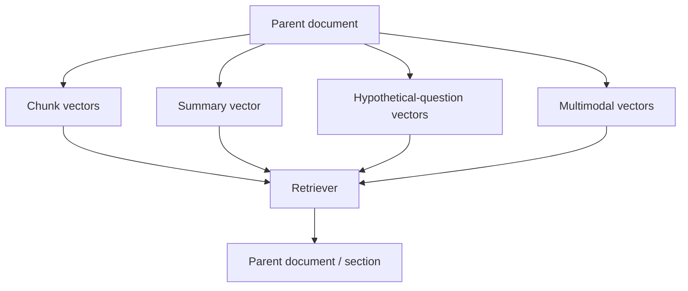

# Multi-Vector Retrieval

A document may be represented by multiple searchable vectors: chunks, summaries, hypothetical questions, titles, entities, tables or image embeddings. Retrieval can match any representation and then map results back to the parent document.



```ts
type SearchVector = {
  parentId: string;
  kind: 'chunk' | 'summary' | 'question' | 'image';
  vector: number[];
};
```

## Failure mode

More vectors can improve recall but multiply index size, update cost and duplicate retrieval. Deduplicate by parent/section and evaluate contribution of each representation.

## Practice

1. Why index summaries as well as chunks?
2. How do hypothetical-question vectors help?
3. What deduplication should happen after retrieval?
4. What metrics would show whether extra vectors justify cost?
