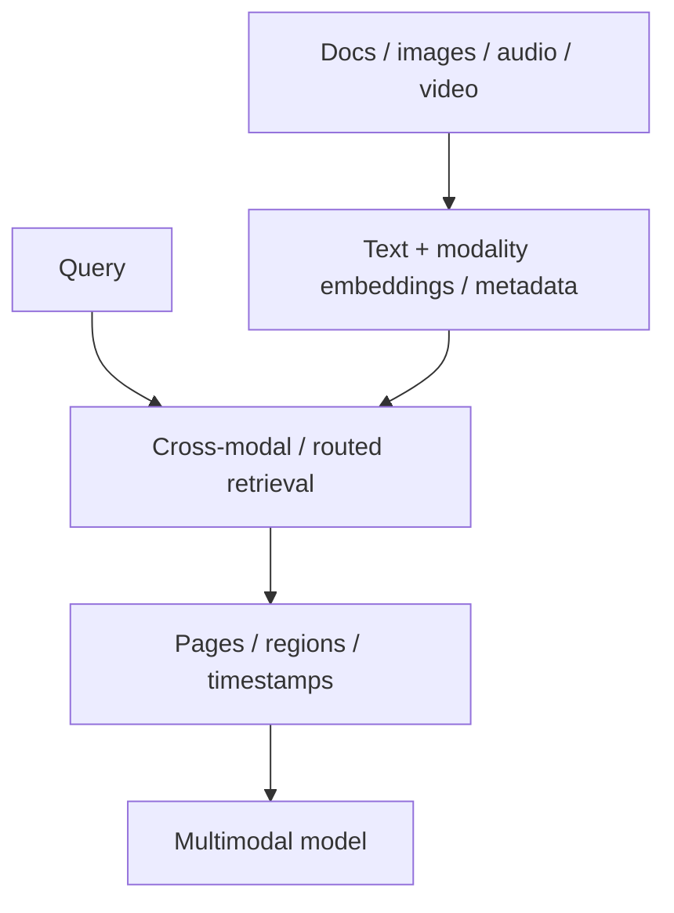

# Multimodal RAG

Multimodal RAG retrieves evidence across text, document pages, images, charts, audio segments and video frames/time ranges.



```ts
type MultimodalHit = {
  assetId: string;
  modality: 'text' | 'image' | 'audio' | 'video';
  page?: number;
  startMs?: number;
  endMs?: number;
};
```

## Grounding

Store coordinates/timestamps so the answer can point to the exact page, figure or time segment. Text-only OCR may lose chart relationships or visual layout; native vision can complement extracted text.

## Practice

1. Why should multimodal retrieval retain coordinates/timestamps?
2. When is OCR insufficient?
3. How can cross-modal embeddings help?
4. What new prompt-injection surface appears with images/documents?
