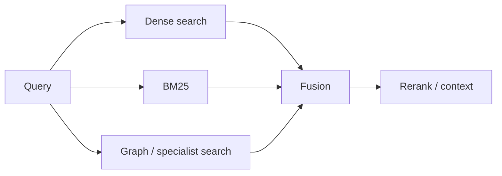

# Retrieval Fusion & Reciprocal Rank Fusion

Multiple retrievers can surface complementary evidence: dense semantic search, BM25, metadata filters, graph traversal or specialized domain indexes. **Rank fusion** combines their ranked lists.



Reciprocal Rank Fusion (RRF) gives each result a score based on its rank across lists rather than requiring incomparable raw similarity scores to share a scale.

```ts
function rrf(rank: number, k = 60) {
  return 1 / (k + rank);
}
```

## Practice

1. Why can raw BM25 and cosine scores be hard to combine directly?
2. What does RRF use instead?
3. When would fusion outperform only dense search?
4. Where does cross-encoder reranking fit after fusion?
