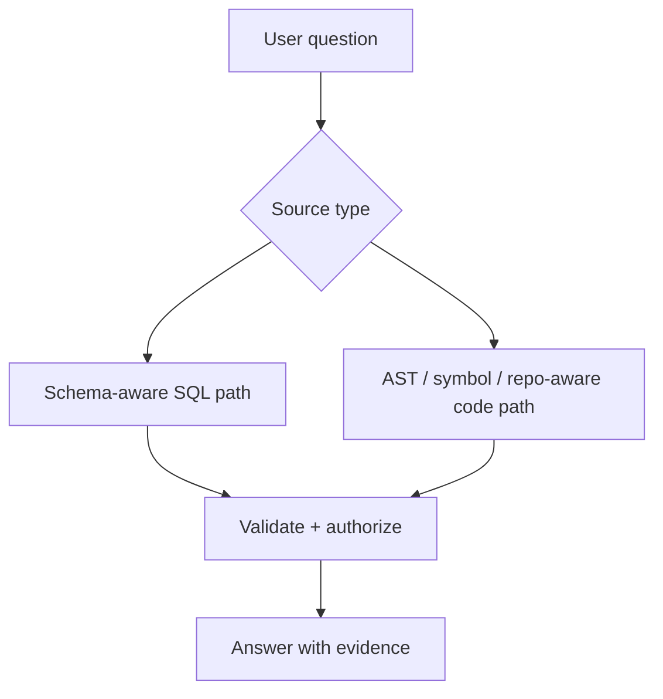

# SQL RAG & Code RAG

Structured databases and source repositories need retrieval strategies that preserve their structure rather than flattening everything into arbitrary text chunks.



```ts
type CodeHit = {
  repository: string;
  path: string;
  symbol?: string;
  startLine: number;
  endLine: number;
};
```

## SQL RAG

Retrieve schema/docs, generate a constrained query plan, enforce read-only/tenant policy and execute parameterized or validated SQL through deterministic code.

## Code RAG

Index symbols, imports, call graphs, docs and file paths. Chunk at semantic boundaries such as functions/classes, then preserve repository/version metadata.

## Practice

1. Why should a model not execute arbitrary generated SQL directly?
2. What metadata makes code retrieval useful for citations?
3. Why are AST/symbol boundaries better than fixed chunks for many code tasks?
4. How would you tenant-scope SQL RAG?
