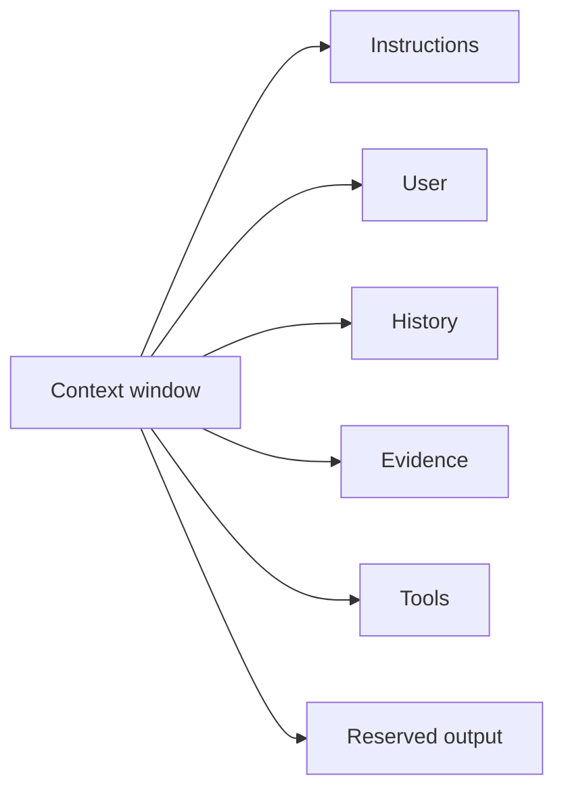

# Context Budgets & Selection

A finite context window must contain instructions, user input, evidence, tools, prior turns and generated tokens. Good systems allocate a **budget** instead of concatenating until the model limit is reached.



```ts
function remainingBudget(max: number, used: number, outputReserve: number) {
  return Math.max(0, max - used - outputReserve);
}
```

## Selection policy

Prioritize security-critical instructions, the current request, high-relevance evidence and required tool schemas. Low-value historic chatter should not crowd out current evidence.

## Practice

1. Why reserve output tokens before context construction?
2. Which content should never be silently truncated?
3. How can tool definitions consume context?
4. Design a budget for a 32k-token support assistant request.
