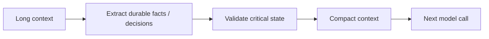

# Context Compaction & Semantic Compression

**Compaction** reduces context while preserving state needed for future work. **Semantic compression** reduces evidence to the facts relevant to the current task.



```ts
type DurableState = {
  goal: string;
  constraints: string[];
  completedSteps: string[];
  pendingSteps: string[];
};
```

Prefer structured durable state for exact facts such as IDs, permissions and workflow status. Use model-generated summaries for narrative context where approximate compression is acceptable.

## Practice

1. What belongs in structured state instead of a natural-language summary?
2. How would you detect summary drift?
3. Why does semantic compression help RAG contexts?
4. What evidence should remain citable after compression?
