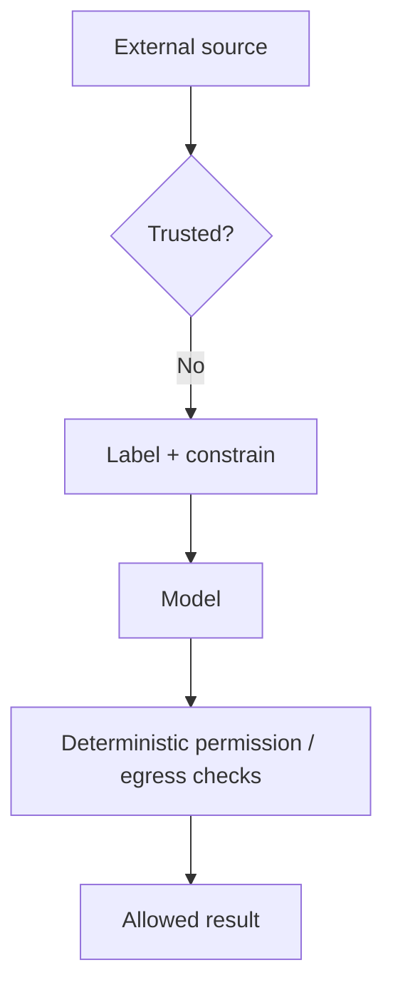

# Context Poisoning, Injection & Evaluation

Untrusted context can contain instructions, false memories, poisoned retrieved documents or tool outputs designed to redirect the model.



```ts
function contextRecord(source: string, text: string, trusted: boolean) {
  return { source, text, trusted, insertedAt: new Date().toISOString() };
}
```

Delimiters are useful for clarity but are not a security boundary. The model can still be influenced by hostile text, so tool permissions and data-flow policy must hold even when the model follows an attack.

## Context evals

Test relevance, omission of critical evidence, distractor resistance, conflicting-source handling, injection resistance, position sensitivity and token-budget overflow.

## Practice

1. Why is prompt injection fundamentally a capability/security problem?
2. What is memory poisoning?
3. How would you evaluate distractor resistance?
4. Which controls must remain deterministic outside the model?
