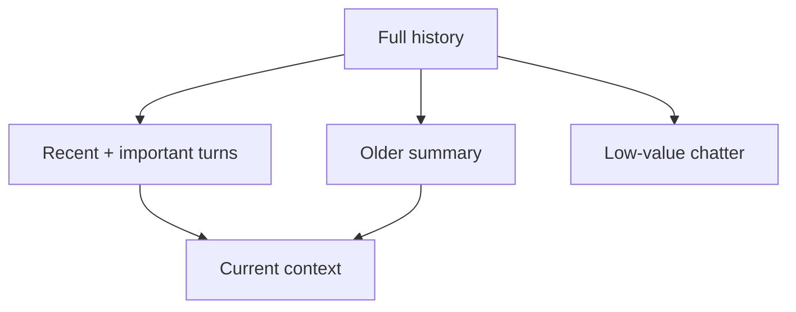

# Conversation History & Trimming

Appending every turn forever is simple but eventually expensive, slow and noisy. History management decides which turns remain verbatim, which are summarized, and which can be dropped.



```ts
function keepRecent<T>(items: T[], count: number) {
  return items.slice(Math.max(0, items.length - count));
}
```

A real policy should be token-aware and importance-aware, not only turn-count based.

## Failure modes

- summaries can introduce hallucinated state;
- dropping a user's constraint can violate intent;
- keeping secret-bearing old tool output may expose data unnecessarily;
- repeated summarization can drift.

## Practice

1. What information should be preserved verbatim?
2. Why can recursive summarization drift?
3. How would you test a history-trimming policy?
4. When is server-side durable state better than keeping facts in chat history?
