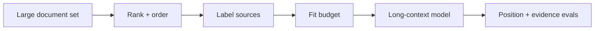

# Long-Context Engineering

Large context windows increase capacity, not guaranteed attention quality. Long contexts increase prefill work, cost, memory and opportunities for conflicting or malicious instructions.



```ts
function placeCriticalEvidence<T>(critical: T[], supporting: T[]) {
  return [...critical, ...supporting];
}
```

Real ordering should be eval-driven. Some tasks exhibit position sensitivity or “lost in the middle” behavior.

## RAG vs long context

Long context can reduce retrieval complexity for bounded datasets, but RAG remains useful for freshness, ACL filtering, citations, cost control and very large corpora.

## Practice

1. Why does a larger context window not eliminate RAG?
2. What is position sensitivity?
3. Which metrics change as input context grows?
4. Design a long-context eval with evidence placed at different positions.
