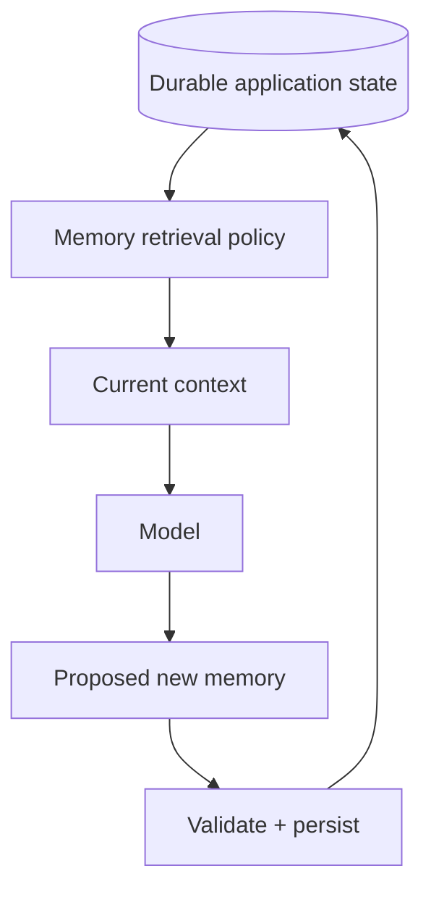

# Memory vs Context vs Application State

These terms are often mixed together.



- **Context**: information visible to the current model call.
- **Memory**: information retained across calls and selectively reintroduced.
- **Application state**: authoritative product data such as order status, permissions or workflow state.

```ts
type MemoryRecord = {
  tenantId: string;
  subjectId: string;
  text: string;
  source: 'user' | 'tool' | 'derived';
  createdAt: string;
};
```

Never make model memory authoritative for security, payments or other critical state.

## Practice

1. Why is database state not the same as model memory?
2. What should happen before a model-generated memory is persisted?
3. Why must memory retrieval be tenant-scoped?
4. Give an example of a fact that belongs in application state rather than memory.
