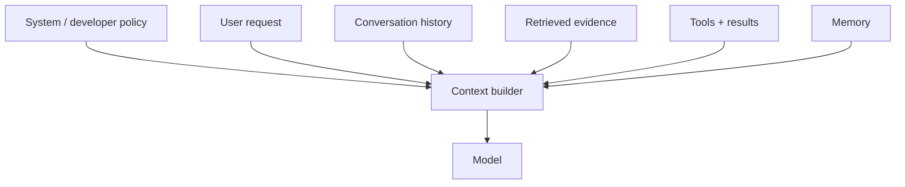

# What Is Context Engineering?

**Prompt engineering** focuses on instructions and demonstrations. **Context engineering** decides the complete information environment the model sees: instructions, conversation history, retrieved evidence, tool definitions/results, memory, schemas and modality inputs.



```ts
type ContextBundle = {
  instructions: string;
  userInput: string;
  history: string[];
  evidence: string[];
  toolResults: unknown[];
};
```

## Core principle

The best context is not the largest context. It is the smallest trustworthy set that lets the model complete the task while preserving required evidence and policy.

## Practice

1. How is context engineering broader than prompt engineering?
2. Which context sources are untrusted by default?
3. Why can adding more context lower quality?
4. What should your context builder record for debugging?
