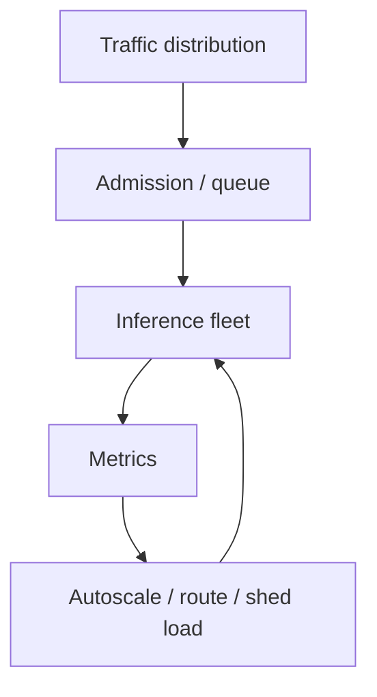

# Capacity Planning & Inference Observability

A production serving fleet must meet latency and availability targets under variable prompt lengths, output lengths and concurrency.



Track request rate, active sequences, queue depth/time, TTFT, TPOT, tokens/sec, prompt/output token distributions, KV-cache utilization, GPU memory/utilization, errors and evictions.

```ts
type CapacitySample = {
  queued: number;
  activeSequences: number;
  kvCacheUtilization: number;
  ttftP95Ms: number;
  tokensPerSecond: number;
};
```

## Load testing

Synthetic load must match real prompt/output length distributions. “100 RPS” is meaningless if test prompts are 20 tokens while production prompts are 20k tokens.

## Practice

1. Why should load tests model token distributions?
2. What does KV-cache pressure do to capacity?
3. Which metric detects queueing before model execution?
4. Design an autoscaling signal that avoids scaling only after SLA failure.
