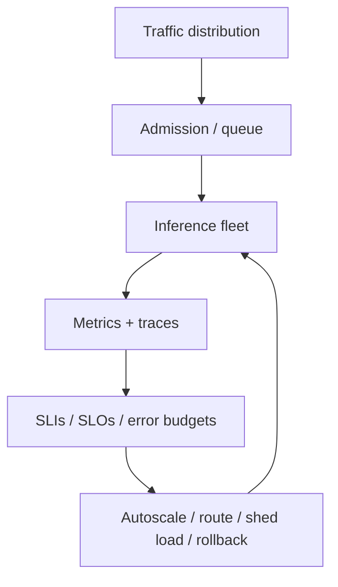

# Capacity Planning & Inference Observability

A production serving fleet must meet latency, availability, quality and cost targets under variable prompt lengths, output lengths and concurrency.



Track request rate, active sequences, queue depth/time, TTFT, TPOT, tokens/sec, prompt/output token distributions, KV-cache utilization, GPU memory/utilization, errors and evictions.

```ts
type CapacitySample = {
  queued: number;
  activeSequences: number;
  kvCacheUtilization: number;
  ttftP95Ms: number;
  tpotP95Ms: number;
  tokensPerSecond: number;
  errorRate: number;
};
```

## Load testing

Synthetic load must match real prompt/output length distributions. “100 RPS” is meaningless if test prompts are 20 tokens while production prompts are 20k tokens.

Also model burstiness, concurrent long generations, tool-call pauses, retries, streaming clients and tenant mix. Capacity tests should measure queue growth and tail latency, not only average throughput.

## GenAI SLIs and SLOs

An **SLI** is a measured indicator. An **SLO** is the target for that indicator over a window. AI systems need both traditional reliability SLIs and task-specific AI SLIs.

Examples:

```text
availability SLI     = successful requests / eligible requests
latency SLI          = % requests with TTFT < 2s
quality SLI          = % sampled tasks passing groundedness/task-success threshold
tool SLI             = successful authorized tool executions / attempted executions
cost SLI             = average or p95 cost per successful task
```

An SLO might be:

```text
99.9% API availability over 30 days
95% of interactive requests TTFT < 2 seconds
99% of payment-tool calls preserve authorization/idempotency invariants
>= 97% groundedness pass rate on the release eval suite
```

Do not collapse all AI quality into one SLO. Keep availability, latency, safety, task quality and cost visible separately because optimizing one can damage another.

```ts
type SloWindow = {
  eligible: number;
  successful: number;
  target: number;
};

function sloCompliance(window: SloWindow) {
  const actual = window.eligible === 0 ? 1 : window.successful / window.eligible;
  return {
    actual,
    target: window.target,
    met: actual >= window.target,
  };
}
```

## Error budgets

If an SLO allows 0.1% failure, that permitted failure is the **error budget**. Use budget burn to control release velocity and risky model/prompt changes.

```text
healthy budget → normal releases
fast budget burn → freeze risky changes / increase sampling / investigate
budget exhausted → rollback, degrade safely, or stop the affected capability
```

For AI systems, define what consumes each budget. A model refusal may be a task failure but not an infrastructure outage; an unauthorized tool execution may consume a safety budget even if the HTTP request returned 200.

## OpenTelemetry for GenAI

OpenTelemetry provides vendor-neutral traces, metrics and logs. Its GenAI semantic conventions standardize attributes for model/agent operations such as provider/model identity, token usage, agent/workflow identity and related telemetry. The GenAI conventions have moved into their own OpenTelemetry GenAI semantic-conventions repository, so pin the convention version used by your instrumentation.

A useful trace shape is:

```text
HTTP request span
  └─ agent/workflow span
      ├─ retrieval span
      ├─ model generation span
      ├─ tool call span
      └─ model generation span
```

Record enough metadata to explain performance and failures without leaking sensitive prompts by default.

```ts
type GenAiTraceAttributes = {
  requestId: string;
  workflowName: string;
  model: string;
  inputTokens?: number;
  outputTokens?: number;
  cachedInputTokens?: number;
  ttftMs?: number;
  totalLatencyMs: number;
  toolCalls: number;
  tenantHash?: string;
};
```

Treat prompt/completion content as sensitive telemetry. Capture it only under explicit retention/access policy; prefer IDs, hashes, redacted samples and structured metadata when full content is unnecessary.

## Quality telemetry vs evals

Observability tells you **what happened**. Evals tell you **whether the behavior was good enough**.

```text
production traces
      |
      +--> deterministic metrics on every run
      |
      +--> sampled semantic/LLM evals
      |
      +--> incident/failure cases added to offline regression set
```

Do not run a large eval suite synchronously inside each user request. Trace every relevant request, evaluate selected production traces asynchronously, and run representative full suites in CI/release workflows.

## Capacity decisions

Scale or route based on leading indicators when possible:

- queue age/depth;
- active sequence count;
- KV-cache pressure;
- GPU memory headroom;
- token throughput;
- p95/p99 TTFT and TPOT;
- provider throttling/error rate;
- SLO error-budget burn.

CPU-style utilization alone can be misleading because sequence length, batching efficiency and KV pressure strongly affect LLM capacity.

## Official references

- OpenTelemetry semantic conventions: https://opentelemetry.io/docs/specs/semconv/
- OpenTelemetry GenAI attributes/migration notice: https://opentelemetry.io/docs/specs/semconv/registry/attributes/gen-ai/
- OpenTelemetry GenAI observability example: https://opentelemetry.io/blog/2026/genai-observability/

## Practice

1. Why should load tests model token distributions?
2. What does KV-cache pressure do to capacity?
3. Which metric detects queueing before model execution?
4. Design an autoscaling signal that avoids scaling only after SLO failure.
5. Define separate latency, task-quality and safety SLOs for a customer-support agent.
6. Why should full prompt/completion content be opt-in telemetry rather than a default trace attribute?
7. What should happen when an AI service burns its error budget unusually fast after a model rollout?
