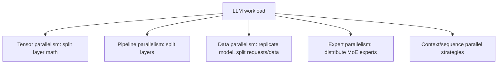

# Tensor, Pipeline, Data, Expert & Context Parallelism

Large models and workloads are distributed in different dimensions.



```ts
type ParallelPlan = {
  tensorParallel: number;
  pipelineParallel: number;
  dataParallel: number;
  expertParallel?: number;
};
```

## Communication is the tax

Parallelism reduces per-device memory or increases throughput but adds synchronization and network traffic. High-bandwidth GPU interconnects can change the best topology dramatically.

## Training vs inference

The same labels can have different implementations and goals across training and serving. For inference, tensor parallelism often helps a model fit and reduces per-token compute latency at the cost of inter-device communication.

## Practice

1. What does tensor parallelism split?
2. What does data parallelism replicate?
3. Why is expert parallelism natural for MoE?
4. Why can more GPUs sometimes reduce efficiency?
