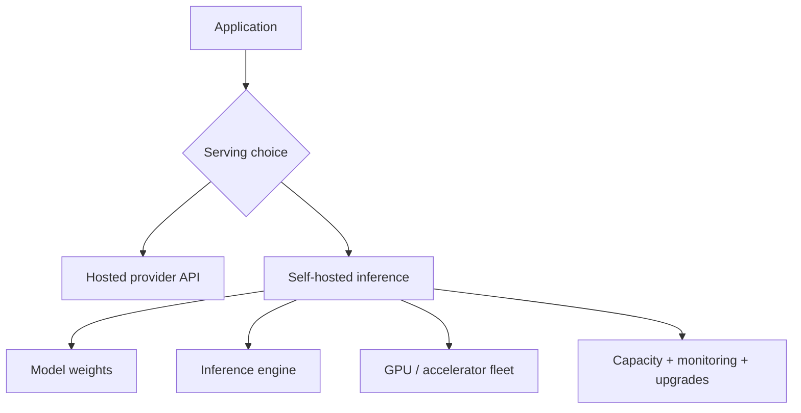

# Hosted APIs vs Self-Hosted Models

Hosted APIs outsource model serving, scaling, hardware and much of reliability. Self-hosting gives deeper control over weights, placement, data path and cost structure but makes you responsible for the serving platform.



```ts
type ServingDecision = {
  dataResidency: 'provider-ok' | 'self-host-required';
  peakRequestsPerSecond: number;
  latencySloMs: number;
  modelControlRequired: boolean;
};
```

## Choose with total cost of ownership

Self-hosting can reduce marginal inference cost at sustained scale, but idle GPUs, on-call, networking, capacity buffers, model conversion, security and upgrade work are real costs.

## Practice

1. What responsibilities move to your team when self-hosting?
2. Why can low utilization make self-hosting expensive?
3. Which privacy constraints might favor self-hosting?
4. What evals must remain identical across hosted and self-hosted routes?
