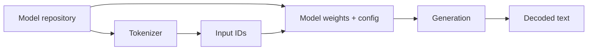

# Local Inference with Hugging Face Transformers

Hugging Face Transformers is a common reference stack for loading model/tokenizer checkpoints, generating locally and experimenting before moving to optimized serving engines.



A TypeScript application may call a local inference service even if model execution itself uses Python/CUDA:

```ts
const response = await fetch('http://localhost:8000/v1/chat/completions', {
  method: 'POST',
  headers: { 'content-type': 'application/json' },
  body: JSON.stringify({
    model: 'local-model',
    messages: [{ role: 'user', content: 'Explain KV cache.' }],
  }),
});

console.log(await response.json());
```

## Experiment vs production

Direct framework generation is excellent for learning and experiments. Production serving often needs continuous batching, efficient KV memory management, metrics, admission control and OpenAI-compatible APIs provided by engines such as vLLM.

## Practice

1. Why load tokenizer and model config from compatible artifacts?
2. What changes when moving from notebook inference to an API server?
3. Why might TypeScript application code still use a Python inference backend?
4. Which model metadata must be pinned for reproducibility?
