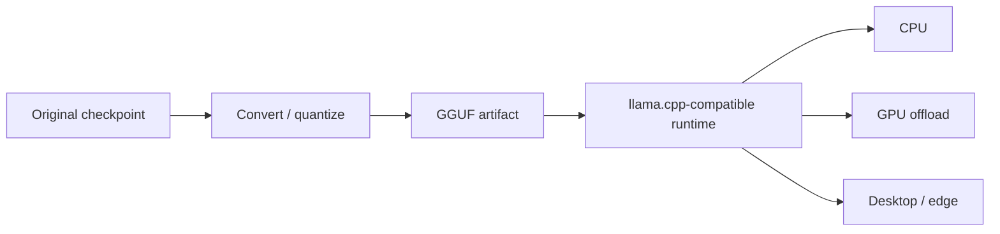

# llama.cpp, GGUF & Edge/CPU Inference

`llama.cpp` popularized efficient local inference for many transformer models across CPU and consumer GPUs. **GGUF** is a model file format that packages weights and metadata used by the llama.cpp ecosystem and related runtimes.



```ts
type LocalModelArtifact = {
  path: string;
  quantization: string;
  contextLength: number;
  sha256: string;
};
```

## Quantization and offload

GGUF models are commonly distributed in multiple quantization levels. Smaller files reduce memory and bandwidth but can affect quality. Some runtimes offload selected layers to GPU while retaining the rest on CPU.

## Security

Treat downloaded weights and model metadata as supply-chain artifacts. Pin trusted sources, verify hashes/signatures where available and scan the surrounding runtime/container dependencies.

## Practice

1. What problem does GGUF solve operationally?
2. Why are many quantized variants of one model published?
3. What is partial GPU offload?
4. Which artifact integrity checks would you use in production?
