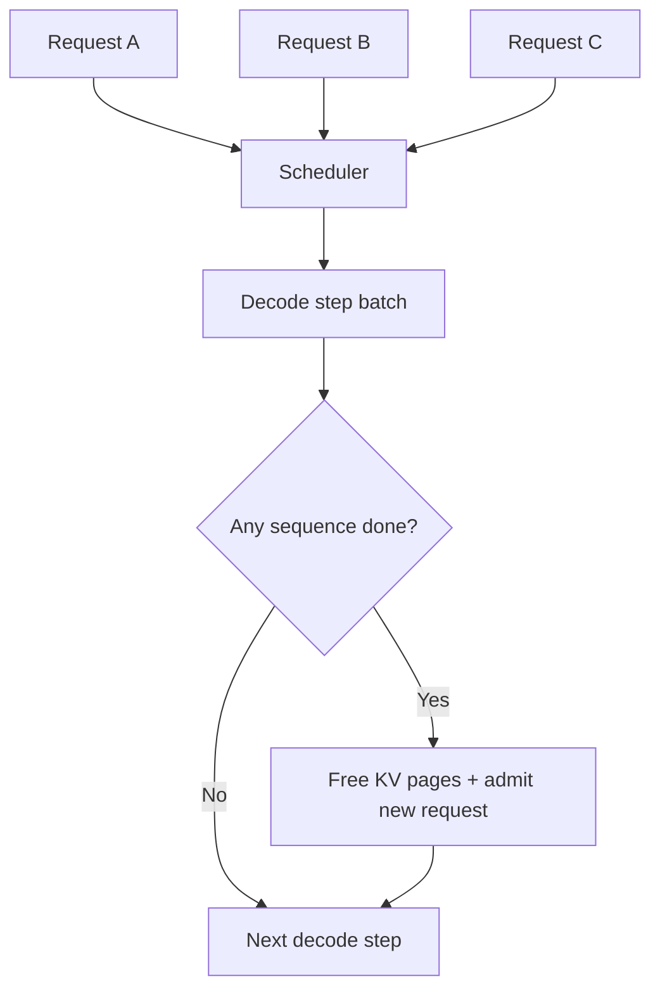

# PagedAttention & Continuous Batching

LLM serving must manage many sequences whose KV caches grow at different rates. Paged KV-memory techniques allocate cache in blocks/pages rather than requiring one large contiguous region per sequence. **Continuous batching** lets the scheduler add and remove requests as sequences progress instead of waiting for a fixed batch to finish.



```ts
type KvBlock = { blockId: number; sequenceId: string; tokens: number };
```

## Why it improves utilization

Traditional static batching wastes time when short sequences finish early. Continuous scheduling keeps accelerator work populated while paged KV allocation reduces fragmentation.

## Practice

1. What memory problem does paged KV allocation address?
2. Why does continuous batching improve utilization?
3. How can aggressive batching hurt latency?
4. What admission-control signals should the scheduler consider?
