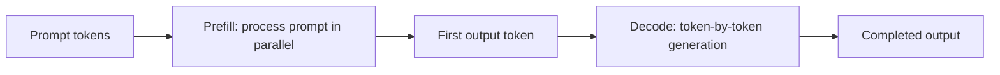

# Prefill, Decode, TTFT & TPOT

Autoregressive serving has two distinct phases.



- **Prefill** processes the input context and builds KV cache.
- **Decode** generates one new token per sequence step while reusing cached K/V state.
- **TTFT** (time to first token) reflects queueing + prefill + initial decode.
- **TPOT** (time per output token) reflects decode performance.

```ts
type LatencyMetrics = {
  ttftMs: number;
  outputTokens: number;
  totalMs: number;
};

function avgTpot(m: LatencyMetrics) {
  return m.outputTokens <= 1 ? 0 : (m.totalMs - m.ttftMs) / (m.outputTokens - 1);
}
```

## Why split metrics

A long prompt can hurt TTFT while decode speed remains excellent. A memory-bandwidth bottleneck can hurt TPOT even with short prompts. One p95 latency number hides the cause.

## Practice

1. Which phase is more sensitive to prompt length?
2. Why does KV cache help decode?
3. What could cause high TTFT with healthy TPOT?
4. What could cause low TTFT but poor TPOT?
