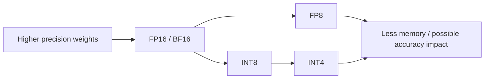

# Quantization: FP16, BF16, FP8, INT8 & INT4

**Quantization** represents model values with lower precision to reduce memory, bandwidth and sometimes compute cost.



```ts
function weightMemoryGiB(parameters: number, bitsPerWeight: number) {
  return (parameters * bitsPerWeight / 8) / 1024 ** 3;
}

console.log(weightMemoryGiB(7e9, 16));
console.log(weightMemoryGiB(7e9, 4));
```

## PTQ vs QAT

**Post-training quantization (PTQ)** converts an already-trained model. **Quantization-aware training (QAT)** simulates/uses lower precision during training so the model can adapt.

Common ecosystems include bitsandbytes, GPTQ, AWQ, GGUF quantization and hardware-specific FP8/INT formats. Compatibility varies by model and inference engine.

## Practice

1. Why can quantization increase effective model capacity per GPU?
2. What quality trade-off can appear at very low precision?
3. Distinguish PTQ and QAT.
4. Why must quantized variants be benchmarked on your task rather than only perplexity?
