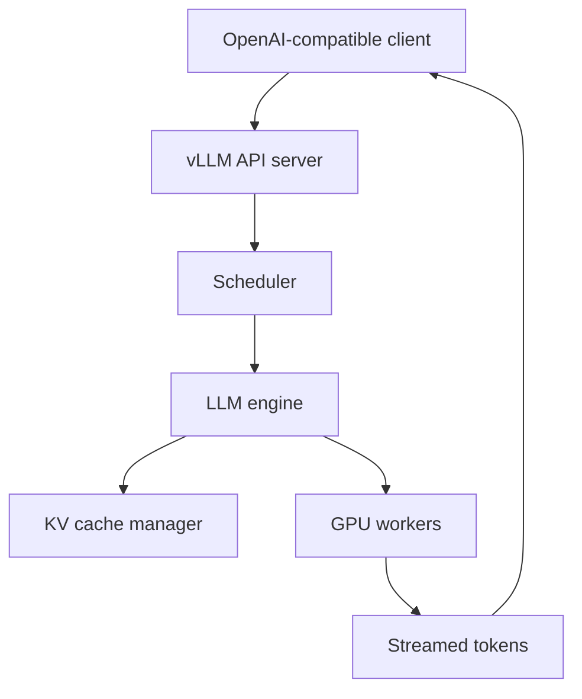

# vLLM Serving Architecture

vLLM is an optimized inference and serving engine for LLMs. Its current feature set includes online serving, OpenAI-compatible APIs, automatic prefix caching, speculative decoding, structured outputs, multimodal inference, observability and distributed serving options.



```ts
const response = await fetch('http://inference.internal/v1/chat/completions', {
  method: 'POST',
  headers: { 'content-type': 'application/json' },
  body: JSON.stringify({
    model: 'served-model',
    messages: [{ role: 'user', content: 'Summarize this incident.' }],
    stream: true,
  }),
});
```

## Why an inference engine exists

Raw model code is not enough for multi-user serving. The engine schedules requests, batches work, manages KV memory, handles distributed workers and exposes metrics/API semantics.

## Practice

1. What does an inference engine add beyond `model.generate()`?
2. Why is an OpenAI-compatible endpoint useful?
3. Which vLLM features reduce repeated-prefix work?
4. What metrics would you monitor on the engine and API layer separately?
