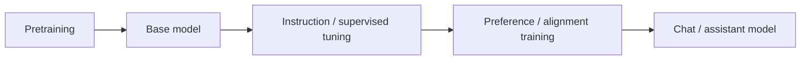

# Base, Instruct & Chat Models

A **base model** is primarily optimized for language-model continuation. **Instruction-tuned** models are post-trained to follow tasks. **Chat models** are instruction models trained and formatted for multi-turn conversational roles and often tool use.



```ts
type Deployment = {
  modelKind: 'base' | 'instruct' | 'chat';
  chatTemplate?: string;
  toolCalling?: boolean;
};
```

## Why the distinction matters

A base model may continue an instruction rather than obey it. A chat model may rely on special role/control tokens. Tool-calling behavior may be learned during post-training and depend on exact templates and schema formats.

## Practice

1. Why can a base model behave differently from an instruct model with the same prompt text?
2. What stage typically teaches conversation roles?
3. Why does self-hosted chat require correct templates?
4. Is “chat model” a fundamentally different neural architecture? Explain.
