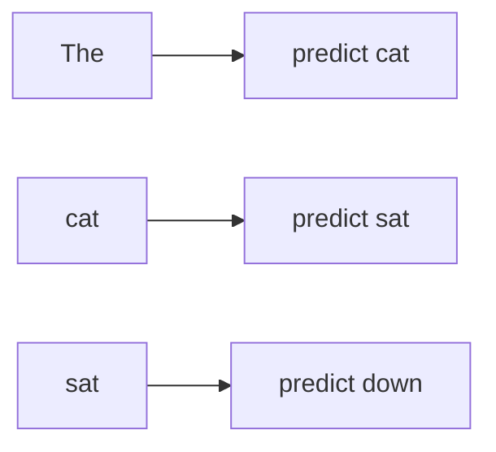

# Causal Language Modeling Objective

A decoder LLM is commonly pretrained to predict the **next token** given previous tokens.



For a token sequence `x1 ... xn`, training maximizes the likelihood of each next token conditioned on its prefix. In practice the training system minimizes cross-entropy over many positions at once.

```ts
function negativeLogLikelihood(targetProbabilities: number[]) {
  return -targetProbabilities.reduce((sum, p) => sum + Math.log(p), 0);
}
```

## Teacher forcing

During training, the true previous tokens are available for every position. During generation, the model must condition on its own generated tokens. This difference helps explain why small mistakes can compound during long generation.

## Self-supervision

Next-token labels come from the text itself, which makes enormous unlabeled corpora useful for pretraining. Human-authored labels become more important later for instruction tuning, preferences and task evals.

## Practice

1. Why is causal language modeling called self-supervised?
2. What is teacher forcing?
3. Why can generation errors compound?
4. How is the training objective different from a product-specific correctness metric?
