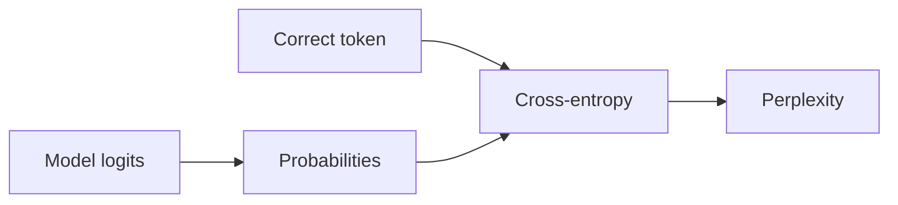

# Cross-Entropy, Log Likelihood & Perplexity

Cross-entropy measures how much probability the model assigns to the correct target tokens. **Perplexity** is an exponentiated average negative log-likelihood and can be interpreted loosely as how uncertain a model is over the evaluated token distribution.



```ts
function perplexity(avgCrossEntropy: number) {
  return Math.exp(avgCrossEntropy);
}
```

## What perplexity is good for

It can compare language-model fit when tokenizer/evaluation setup is comparable. It is useful for training monitoring and some model research.

## What it does not tell you

Perplexity does not directly measure truthfulness, tool correctness, instruction following, safety, code execution success or product utility. Different tokenizers can also make naive perplexity comparisons misleading.

## Practice

1. Why does lower cross-entropy mean the correct token received more probability?
2. Why must tokenizer/eval setup be comparable when comparing perplexity?
3. Name three product qualities perplexity does not measure.
4. Why should product evals supplement model loss?
