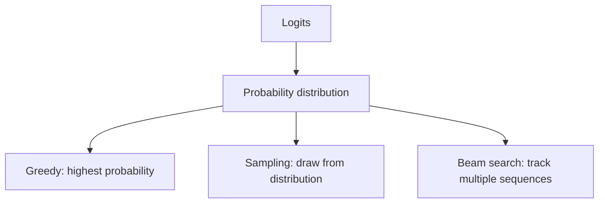

# Greedy, Sampling & Beam Decoding

After the model produces logits, a **decoding strategy** decides how to select output tokens.



```ts
function greedyIndex(probabilities: number[]) {
  return probabilities.reduce((best, p, i, arr) => p > arr[best] ? i : best, 0);
}
```

## Sampling controls

Temperature reshapes probabilities; top-p limits to a cumulative probability mass; top-k limits to a fixed number of candidate tokens. Support differs across providers and reasoning-model families.

## Beam search

Beam search is useful in some sequence-generation tasks but is not the universal best choice for open-ended chat. It can favor generic high-probability sequences and increases compute.

## Practice

1. Why is greedy decoding deterministic only given a deterministic stack?
2. How does top-p differ from top-k?
3. Why can beam search be undesirable for creative conversation?
4. Which decoding approach would you evaluate for constrained translation versus brainstorming?
