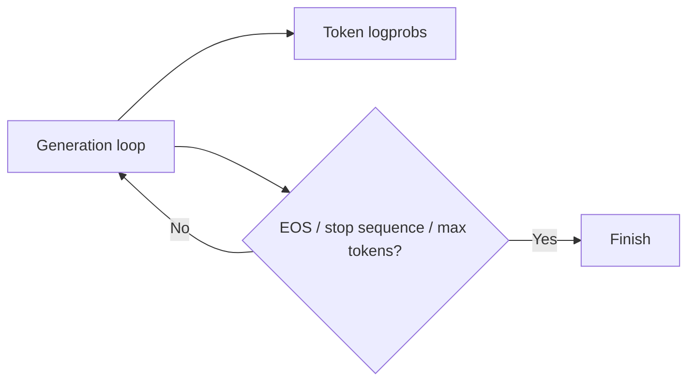

# Logprobs, Stop Sequences & Repetition Controls

Generation APIs may expose **log probabilities**, stop conditions and repetition controls. These are useful diagnostics and controls, not guarantees of semantic correctness.



```ts
function probabilityFromLogprob(logprob: number) {
  return Math.exp(logprob);
}
```

## Logprobs

A token logprob reflects the model's local distribution, not calibrated factual confidence. High probability can still correspond to a false statement.

## Stop sequences

Stops can terminate text when a delimiter appears, but structured-output APIs are usually better for machine boundaries. Beware of user-controlled content accidentally containing a stop marker.

## Repetition penalties

Provider-specific frequency/presence penalties or logits processors can reduce repetition, but they may damage exact quoting, code or structured output.

## Practice

1. Why is token probability not factual confidence?
2. What can go wrong with a naive stop sequence?
3. Why can repetition penalties hurt code generation?
4. What stronger boundary would you use for JSON output?
