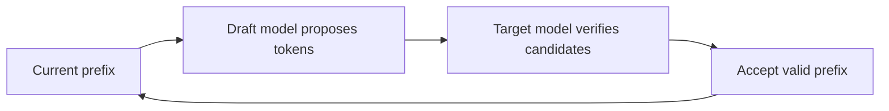

# Speculative Decoding

**Speculative decoding** accelerates autoregressive generation by using a cheaper draft process to propose several candidate tokens, then having the target model verify them efficiently.



The target model still determines the final distribution when the algorithm is implemented correctly; the speedup comes from reducing expensive sequential target-model decode work.

```ts
type SpeculativeConfig = {
  draftTokens: number;
  draftModel: string;
  targetModel: string;
};
```

## Trade-offs

Speedup depends on draft quality, verification cost, batch size, hardware and workload. A poor draft model creates many rejected candidates and little benefit.

## Practice

1. Why does speculative decoding not simply trust the small model's answer?
2. What determines candidate acceptance efficiency?
3. Why may a technique that speeds single-request latency behave differently under heavy batching?
4. Which metrics would you compare before enabling it?
