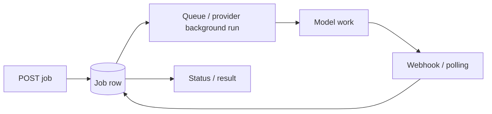

# Background Runs, Webhooks & Batch Processing

Long or high-volume workloads should not hold a user HTTP request open indefinitely. Use provider/background jobs, your own queue, webhooks or batch processing according to latency and scale requirements.



```ts
type AiJob = {
  id: string;
  status: 'queued' | 'running' | 'completed' | 'failed' | 'cancelled';
  providerRunId?: string;
  idempotencyKey: string;
};
```

## Webhook rule

Verify webhook signatures, deduplicate repeated delivery, store event IDs and make handlers idempotent. Never assume exactly-once delivery.

## Batch rule

Batch processing suits offline classification, embeddings, evals and large document jobs where immediate latency is unnecessary. Store per-item correlation IDs so partial failures can be retried without replaying successful items.

## Practice

1. When is polling simpler than webhooks?
2. Why must webhook handlers be idempotent?
3. What makes a workload a good batch candidate?
4. How would you retry only failed items from a large batch?
