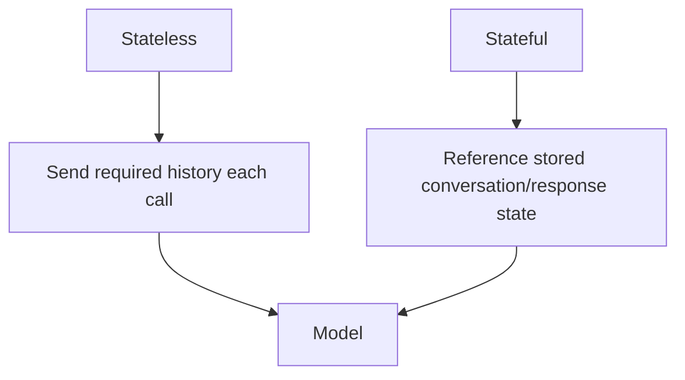

# Stateless vs Stateful Conversations

A **stateless** integration sends all required context each call. A **stateful** API or application stores conversation/run state and lets later requests reference it.



```ts
type ConversationRecord = {
  id: string;
  tenantId: string;
  providerConversationId?: string;
  createdAt: string;
  retentionPolicy: 'ephemeral' | 'persistent';
};
```

## Architecture choice

Stateful provider features can simplify continuation, but you still need product-level retention policy, tenant mapping, deletion behavior, auditability and migration strategy. Provider conversation state should not become your only source of truth for business workflows.

## Practice

1. What does a stateless request need to resend?
2. Why does provider-managed state create retention considerations?
3. Which data must remain in your own database even with stateful APIs?
4. How would you migrate conversations between providers?
