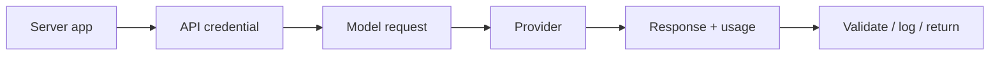

# Your First Production LLM Request

A production model call is more than `prompt → text`. It has authentication, model selection, timeout, usage, error handling, tracing and output validation.



```ts
import OpenAI from 'openai';

const client = new OpenAI({ apiKey: process.env.OPENAI_API_KEY });

const response = await client.responses.create({
  model: process.env.AI_MODEL!,
  input: 'Explain idempotency with one concrete API example.',
});

console.log(response.output_text);
```

Keep credentials server-side. Treat the response as untrusted data when it crosses into business logic.

## Minimum production wrapper

Capture request ID, model, latency, input/output token usage, prompt/version identifier and failure category. Apply timeouts and route through a typed adapter so provider objects do not leak across your domain layer.

## Practice

1. Why should API keys never ship in a browser bundle?
2. What metadata should every production model call record?
3. Why validate even when the provider offers structured output?
4. Which fields should your provider adapter expose to application code?
