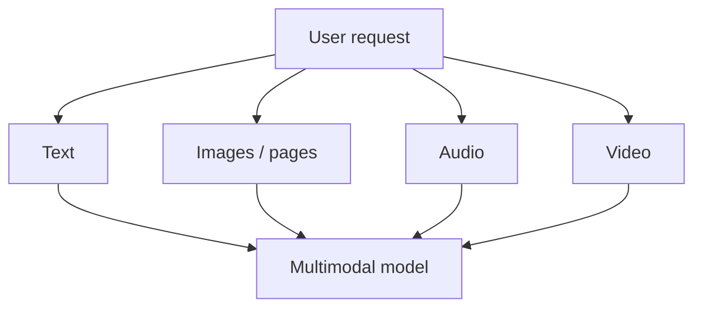

# Images, PDFs, Audio & Video Inputs

Multimodal LLM integration is not “convert everything to text.” Modern models can accept images, documents, audio and sometimes video directly, preserving layout, visual and temporal information that text extraction may lose.



```ts
type InputAsset = {
  id: string;
  mimeType: string;
  source: 'upload' | 'url' | 'storage';
  tenantId: string;
};
```

## Engineering concerns

- validate MIME type and file size;
- scan untrusted files;
- enforce tenant access before creating model inputs;
- understand modality-specific token/cost accounting;
- preserve page/time coordinates for citations;
- protect against instructions embedded inside images/documents.

## Practice

1. Why can native document vision outperform plain text extraction for some PDFs?
2. What metadata enables page-level citations?
3. How can an image carry prompt injection?
4. When should you preprocess media before model submission?
