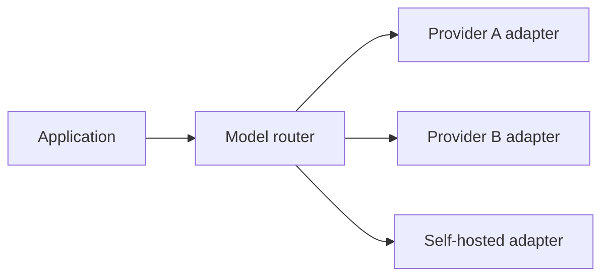

# Provider Abstraction, Routing & Fallbacks

A provider abstraction isolates product logic from vendor SDK details while still allowing capability-specific behavior.



```ts
type Capability = 'text' | 'vision' | 'tools' | 'structured' | 'realtime';

interface ModelAdapter {
  supports(capability: Capability): boolean;
  generate(input: unknown): Promise<{ output: unknown; usage?: unknown }>;
}
```

## Do not abstract away semantics

Providers differ in tool behavior, schema support, reasoning controls, retention, modality limits and streaming events. The abstraction should normalize your domain contract, not pretend all capabilities are identical.

Fallbacks must pass the same eval suite and security policy. A fallback that returns an answer but breaks citations or tool schemas is not resilience.

## Practice

1. What belongs in a provider adapter?
2. What differences should remain explicit?
3. Why must fallback models be pre-evaluated?
4. Design a route for cheap extraction vs expensive reasoning tasks.
