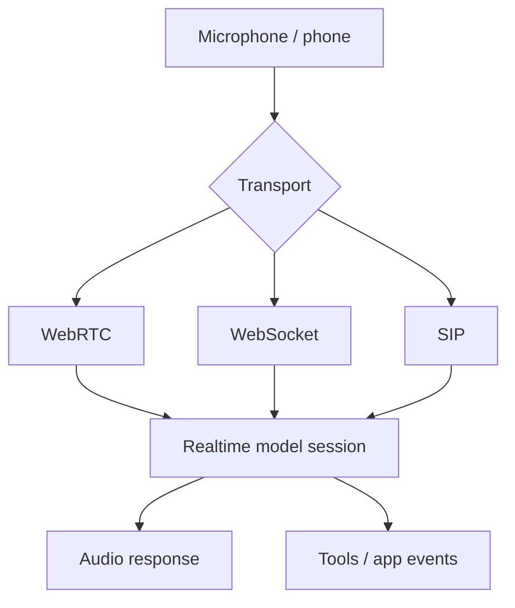

# Realtime LLMs with WebRTC, WebSocket & SIP

Realtime applications exchange low-latency audio/text/events while a session is active. Browser/mobile voice apps often use **WebRTC**; server-to-server systems commonly use **WebSocket**; telephony integrations may use **SIP**.



```ts
type RealtimeSessionState = {
  sessionId: string;
  speaking: boolean;
  interrupted: boolean;
  lastEventId?: string;
};
```

## Voice UX concepts

VAD/turn detection decides when a user starts/stops speaking. **Barge-in** cancels or truncates assistant speech when the user interrupts. Tool latency becomes conversational latency, so slow tool calls need progress UX or asynchronous patterns.

## Practice

1. Why is WebRTC attractive for browser audio?
2. What is barge-in?
3. Why does tool latency matter more in voice UX?
4. How would you recover a realtime session after a mobile network change?
