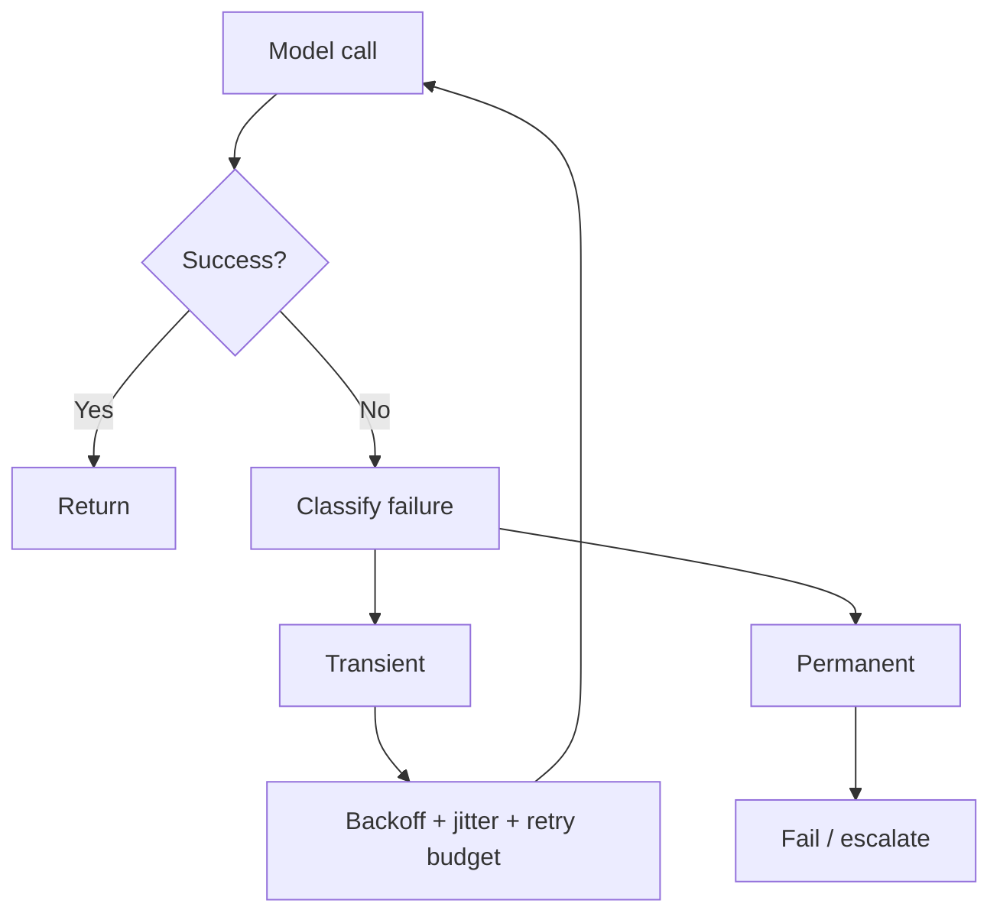

# Rate Limits, Timeouts, Retries & Circuit Breakers

LLM APIs are distributed systems. Requests can queue, rate-limit, time out, partially stream or fail after a tool side effect.



```ts
function backoffMs(attempt: number, base = 250) {
  const jitter = Math.random() * base;
  return Math.min(10_000, base * 2 ** attempt + jitter);
}
```

Do not retry validation errors, permission denials or non-idempotent side effects blindly.

## Budgets

Define overall request deadline, provider timeout, tool timeout and retry count together. A three-attempt retry policy is meaningless if each attempt can consume the entire user SLA.

## Practice

1. Which errors are retryable?
2. Why add jitter?
3. How does a circuit breaker protect your system?
4. How would you budget a 10-second product SLA across model and tool calls?
