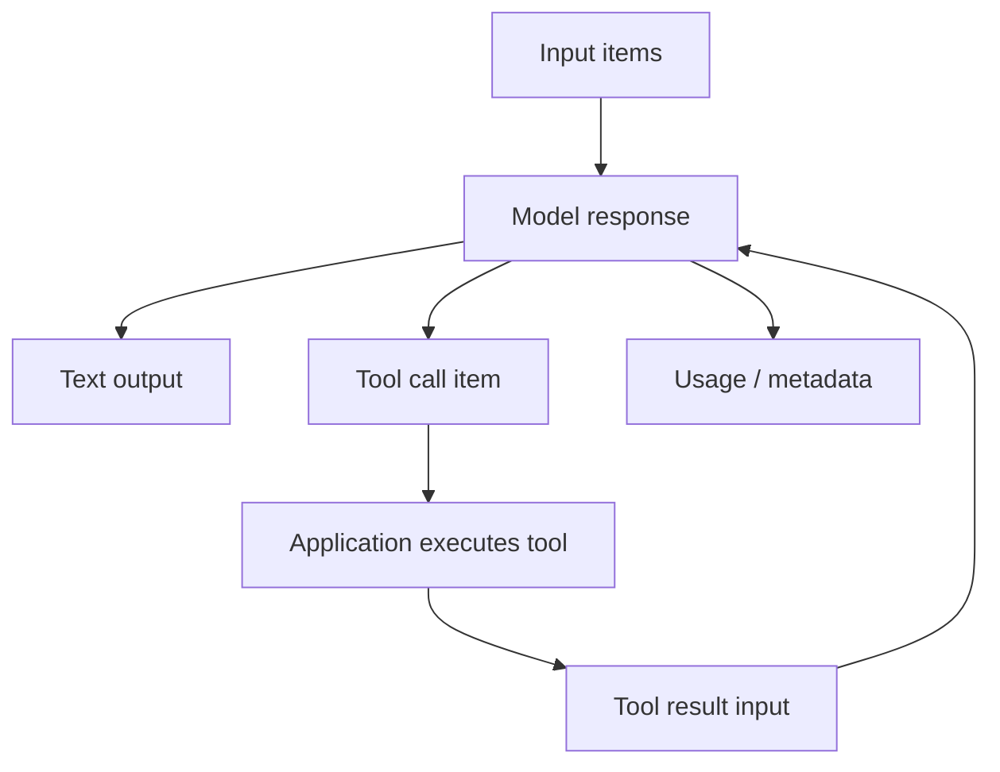

# Request, Response & Item Lifecycle

Modern model APIs represent a response as structured **items/events**, not merely one string. Inputs may include text, files, images, prior state and tool results; outputs may include text, reasoning metadata, tool calls and usage.



```ts
type RunItem =
  | { type: 'text'; text: string }
  | { type: 'tool_call'; name: string; arguments: unknown }
  | { type: 'tool_result'; name: string; result: unknown };
```

## Why item models matter

They make tool loops, multimodal content and streaming easier to reason about than concatenated prose. Persist normalized item history rather than scraping visible text when your product needs resumable workflows.

## Practice

1. Why is a response object richer than `output_text`?
2. What item types would you persist for a resumable tool workflow?
3. Why should tool results remain structured?
4. What metadata belongs outside visible assistant text?
