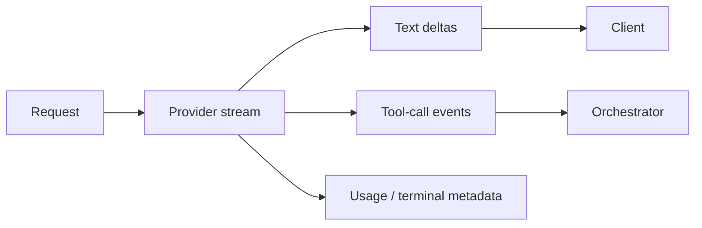

# Streaming Responses & Event Handling

Streaming sends incremental events before the response is complete, improving perceived latency and enabling live tool/status UIs.



```ts
for await (const event of stream) {
  switch (event.type) {
    case 'response.output_text.delta':
      process.stdout.write(event.delta);
      break;
    case 'response.completed':
      console.log('\ncomplete');
      break;
  }
}
```

Use the provider's actual event types for the SDK/version you pin.

## Failure modes

A client can disconnect after receiving partial text. A tool call can arrive after earlier text. Moderation/policy may need to stop display. The authoritative result is the terminal state, not “some text arrived.”

## Practice

1. Why does streaming not necessarily reduce compute latency?
2. What should happen on client disconnect?
3. Why must your UI understand event types rather than concatenate arbitrary bytes?
4. When should streamed output be persisted?
